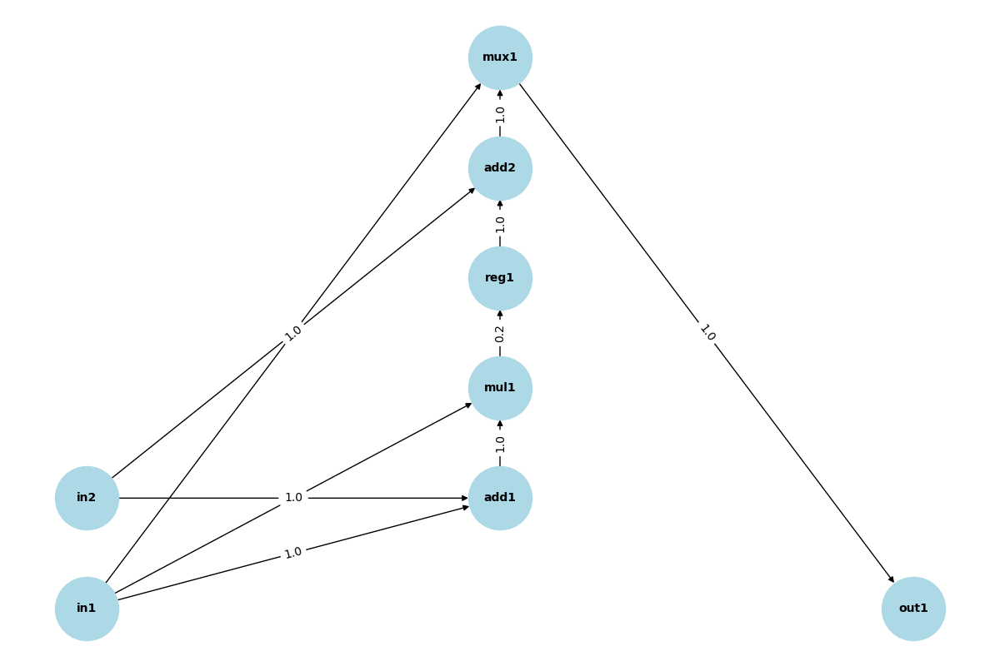
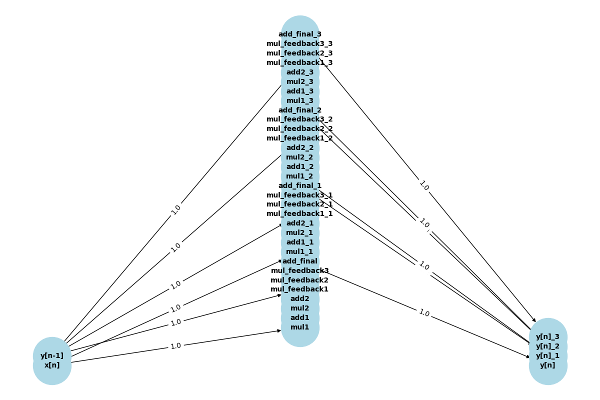

# Digital Circuit Analysis 🔌⚡

[](https://www.python.org/)
[](LICENSE)
[](https://networkx.org/)

A powerful Python-based tool for analyzing digital circuits to identify critical paths and calculate timing delays. This project helps determine the maximum operating frequency of both combinational and sequential circuits through graph-based analysis and visualization.

## 📋 Table of Contents

- [Features](#-features)
- [Project Structure](#-project-structure)
- [Installation](#-installation)
- [Usage](#-usage)
- [Circuit File Format](#-circuit-file-format)
- [Examples](#-examples)
- [How It Works](#-how-it-works)
- [Contributing](#-contributing)
- [License](#-license)
- [Acknowledgments](#-acknowledgments)

## ✨ Features

- **Critical Path Analysis**: Automatically identifies the longest path through a circuit
- **Delay Calculation**: Computes total propagation delays with component-level granularity
- **Graph Visualization**: Generates visual representations of circuits with highlighted critical paths
- **Multiple Gate Support**: Supports ADD, MUL, REG, and MUX components
- **Sequential Circuit Analysis**: Handles both combinational and sequential circuits
- **Flexible Input Format**: Simple text-based circuit description language
- **Detailed Reporting**: Provides comprehensive analysis output with component breakdowns

## 📁 Project Structure

```
digital-circuit-analysis/
├── src/                          # Source code
│   ├── main.py                   # Main application entry point
│   └── circuit_analyzer.py       # Core circuit analysis logic
├── examples/                     # Example circuit files
│   ├── cir1.txt                  # Example circuit 1
│   ├── cir2.txt                  # Example circuit 2
│   ├── cir3.txt                  # Example circuit 3
│   ├── cir4.txt                  # Example circuit 4
│   └── cir5.txt                  # Example circuit 5
├── docs/                         # Documentation files
│   └── Assignment 3.pdf          # Project specification
├── output/                       # Generated circuit visualizations (gitignored)
├── requirements.txt              # Python dependencies
├── README.md                     # This file
├── CONTRIBUTING.md               # Contribution guidelines
├── LICENSE                       # MIT License
└── .gitignore                    # Git ignore rules
```

## 🚀 Installation

### Prerequisites

- Python 3.8 or higher
- pip (Python package manager)

### Steps

1. **Clone the repository**:
   ```bash
   git clone https://github.com/muzammil5539/digital-circuit-analysis.git
   cd digital-circuit-analysis
   ```

2. **Create a virtual environment** (recommended):
   ```bash
   python -m venv venv
   
   # On Linux/macOS:
   source venv/bin/activate
   
   # On Windows:
   venv\Scripts\activate
   ```

3. **Install dependencies**:
   ```bash
   pip install -r requirements.txt
   ```

## 💻 Usage

### Basic Usage

Run the analyzer on all example circuits:

```bash
python src/main.py
```

### Custom Circuit Analysis

To analyze a specific circuit file:

```python
from src.circuit_analyzer import CircuitAnalyzer

# Analyze a circuit
analyzer = CircuitAnalyzer('path/to/your/circuit.txt')
critical_path, total_delay = analyzer.find_critical_path()

print(f"Critical Path: {' -> '.join(critical_path)}")
print(f"Total Delay: {total_delay:.2f} time units")

# Generate visualization
analyzer.visualize_circuit(critical_path)
```

### Output

The program generates:
1. **Console Output**: Detailed component analysis and critical path information
2. **Visualizations**: PNG images in the `output/` directory showing circuit graphs with highlighted critical paths

## 📝 Circuit File Format

Circuit files use a simple text-based format:

```
# Comments start with #
INPUT <input_node_id>

<GATE_TYPE> <node_id> <input1> <input2> ...

OUTPUT <output_node_id> <final_node>
```

### Supported Gate Types

| Gate Type | Delay (time units) | Description |
|-----------|-------------------|-------------|
| ADD       | 1.0              | Addition gate |
| MUL       | 1.0              | Multiplication gate |
| REG       | 0.2              | Register (sequential element) |
| MUX       | 1.0              | Multiplexer |

### Example Circuit File

```
# Simple adder circuit
INPUT x[n]

ADD add1 x[n]
MUL mul1 add1
REG reg1 mul1
ADD add2 reg1

OUTPUT y[n] add2
```

## 📊 Examples

### Circuit 1: Sequential Adder-Multiplier

**Circuit Description**: A sequential circuit with feedback through a register

**Critical Path**: `x[n] -> add1 -> mul1 -> reg1 -> add2 -> mux1 -> y[n]`

**Total Delay**: 4.2 time units



### Circuit 2: Simple Combinational Circuit

**Circuit Description**: A basic combinational logic circuit



### More Examples

Additional circuit examples can be found in the `examples/` directory. Run the main program to analyze all examples and generate visualizations.

## 🔧 How It Works

### Algorithm Overview

1. **Circuit Parsing**: Reads and parses the circuit description file
2. **Graph Construction**: Builds a directed acyclic graph (DAG) representation
3. **Topological Sorting**: Orders nodes using depth-first search (DFS)
4. **Critical Path Computation**: Uses dynamic programming to find the longest path
5. **Visualization**: Generates graph visualization with NetworkX and Matplotlib

### Key Components

- **CircuitAnalyzer**: Main class that orchestrates the analysis
  - `parse_circuit()`: Parses circuit file into graph structure
  - `find_critical_path()`: Identifies the longest delay path
  - `visualize_circuit()`: Creates visual representation

### Design Decisions

- **Graph-based representation**: Enables efficient path analysis using graph algorithms
- **Component delay model**: Simplified but realistic delay values for common gates
- **Modular architecture**: Separates parsing, analysis, and visualization concerns

## 🤝 Contributing

We welcome contributions from the community! Please see [CONTRIBUTING.md](CONTRIBUTING.md) for detailed guidelines on:

- Reporting bugs
- Suggesting enhancements
- Submitting pull requests
- Coding standards
- Development setup

## 📄 License

This project is licensed under the MIT License - see the [LICENSE](LICENSE) file for details.

## 🙏 Acknowledgments

- Built with [NetworkX](https://networkx.org/) for graph algorithms
- Visualization powered by [Matplotlib](https://matplotlib.org/)
- Numerical operations with [NumPy](https://numpy.org/)

---

**Note**: This project was developed as part of a digital circuit analysis assignment. For academic context, see `docs/Assignment 3.pdf`.

For questions or support, please open an issue on GitHub.

