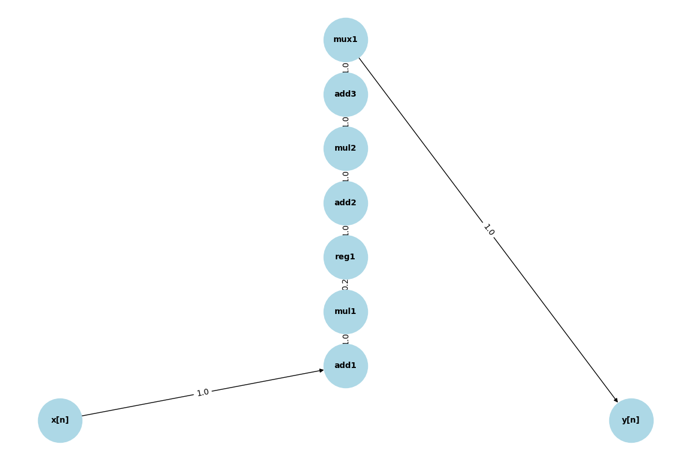

# Digital Circuit Analysis

## Overview

This project analyzes digital circuits to find their critical paths, which determine the maximum operating frequency of the circuit. It supports both combinational and sequential circuits.

## Project Structure

```
digital-circuit-analysis
├── src
│   ├── main.py
│   ├── circuit_parser.py
│   ├── critical_path_finder.py
│   ├── delay_calculator.py
│   ├── visualizer.py
│   └── tests
│       ├── test_circuit1.txt
│       ├── test_circuit2.txt
│       ├── test_circuit3.txt
│       ├── test_circuit4.txt
│       ├── test_circuit5.txt
│       └── test_critical_path.py
├── requirements.txt
└── README.md
```

## Installation Instructions

1. Clone the repository:
   ```
   git clone <repository-url>
   ```
2. Navigate to the project directory:
   ```
   cd digital-circuit-analysis
   ```
3. Install the required dependencies:
   ```
   pip install -r requirements.txt
   ```

## Usage Instructions

1. Prepare your circuit description files in the `src/tests` directory.
2. Run the main application:
   ```
   python src/main.py
   ```
3. The program will read the circuit descriptions, analyze them, and print the critical paths along with their delays.

## Example Inputs and Outputs

- **Input:** A circuit description file (e.g., `test_circuit1.txt`)
- **Output:**
  ```
  Circuit name: adder1
  Critical Path: in1 -> add1 -> mul1 -> reg1 -> add2 -> out1
  Path Components:
  - ADD (add1): 1.0 tu
  - MUL (mul1): 1.0 tu
  - REG (reg1): 0.2 tu
  - ADD (add2): 1.0 tu
  Total Delay: 3.2 time units
  ```

## Circuit Visualizations

Here are some visualizations of the circuits:

### Circuit 1: adder1



### Circuit 2: simple1


### Circuit 3: complex1


### Circuit 4: sequential1


### Circuit 5: cir5


## Design Decisions and Assumptions

- The project uses a graph-based approach to represent circuits.
- Delays for components are predefined based on typical values.
- The program handles both combinational and sequential circuits effectively.

## Testing

Unit tests are provided in the `src/tests` directory to ensure the functionality of critical path identification across various circuit configurations.
